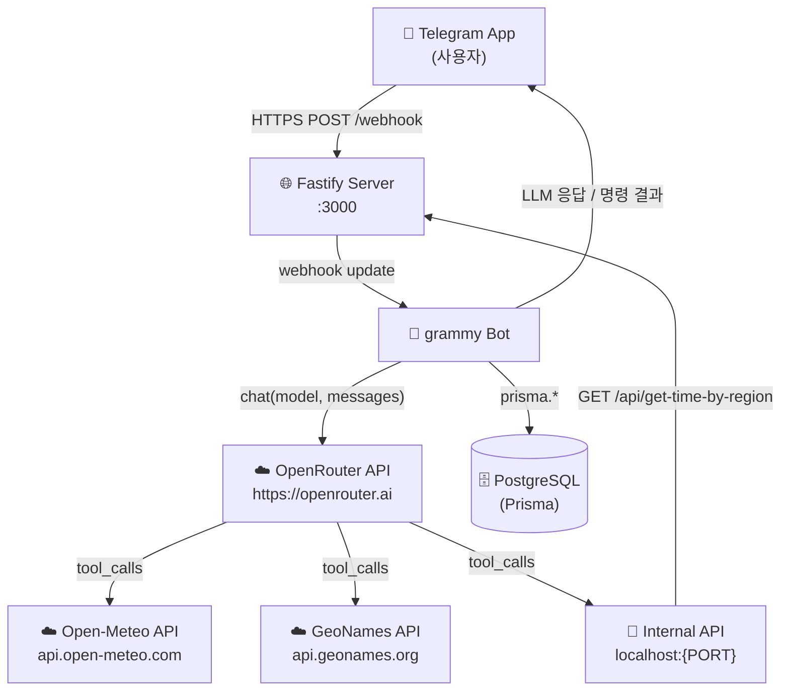
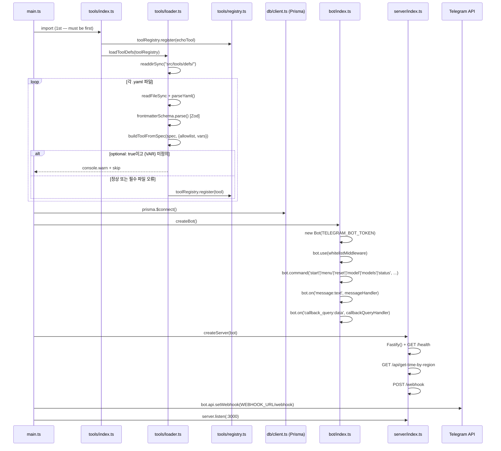
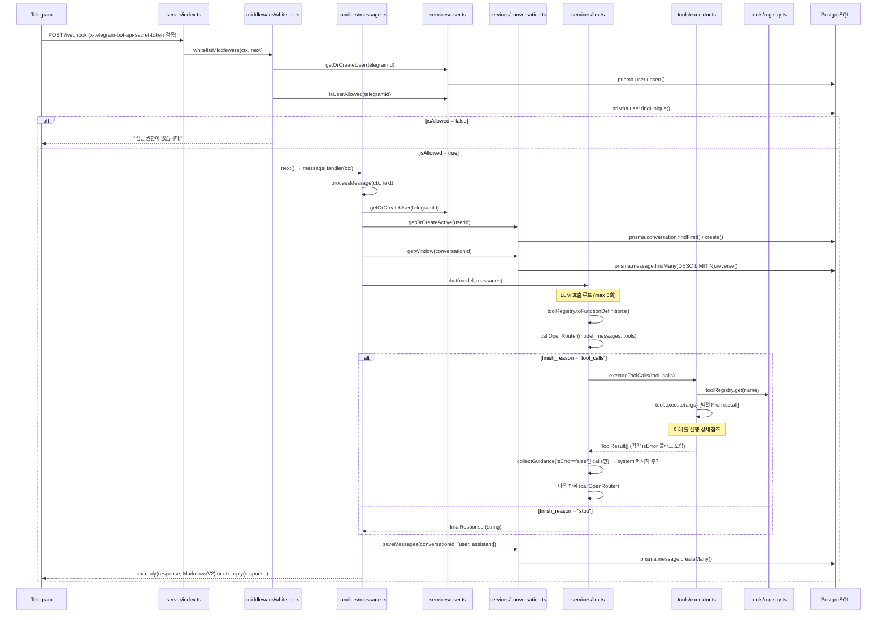
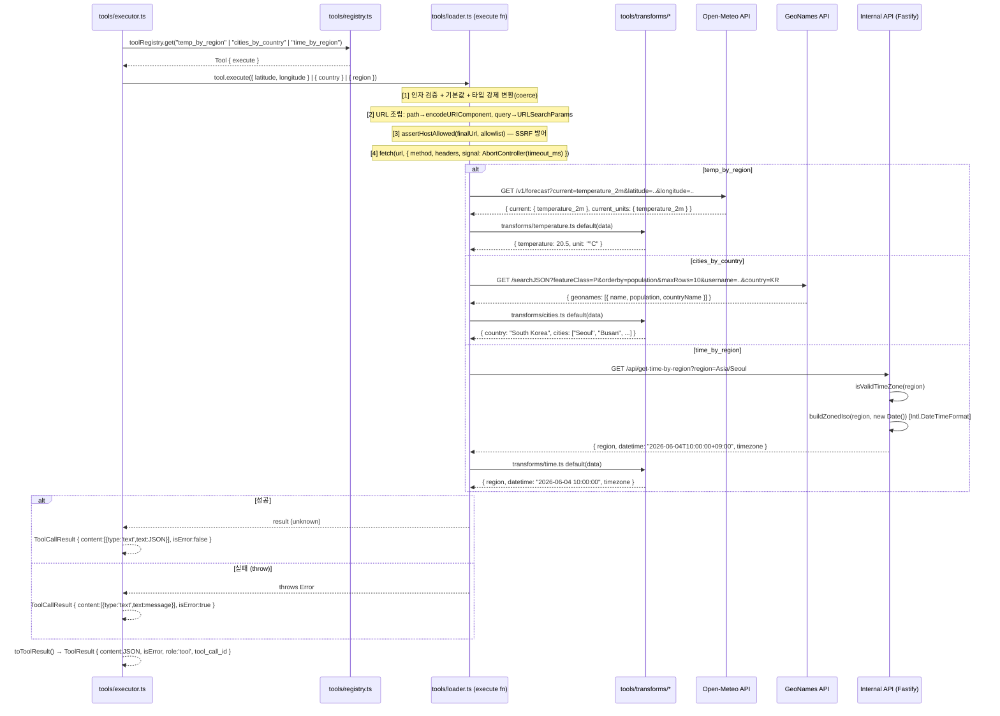
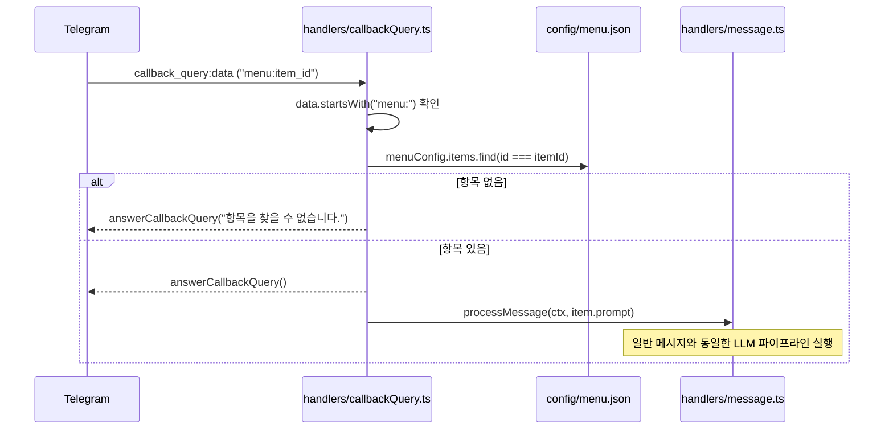
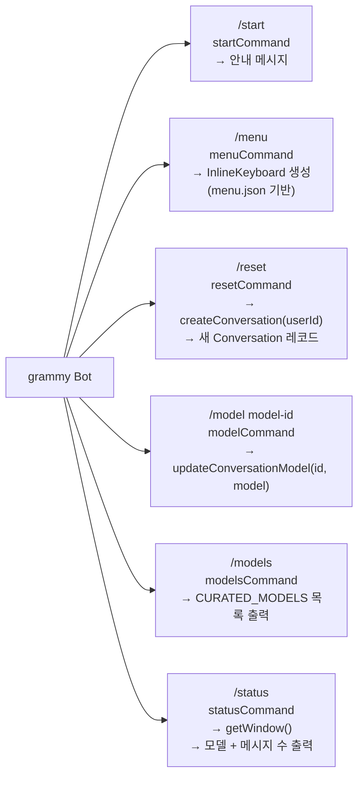
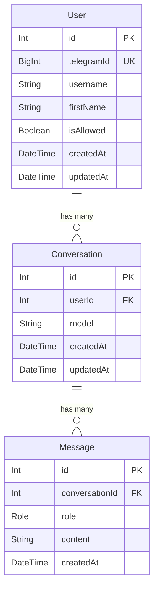
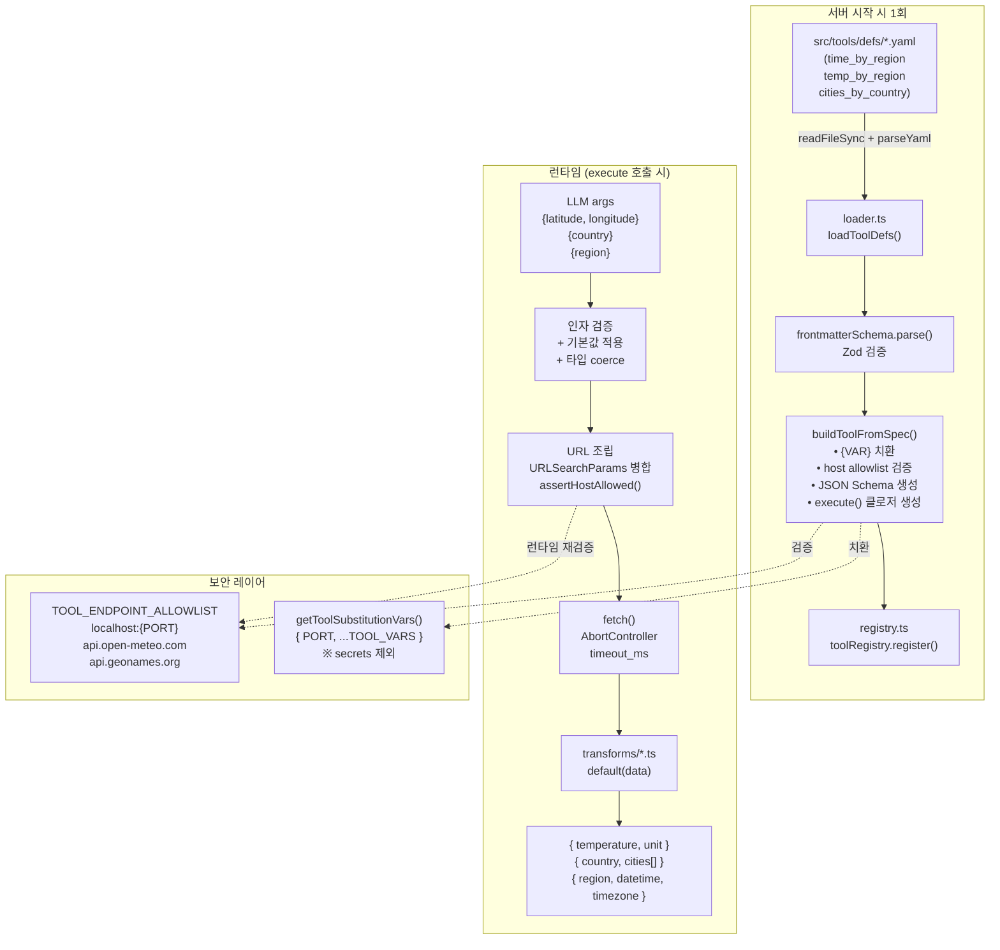
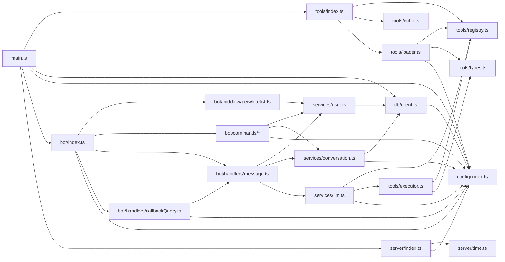

# Application Architecture Diagram

> **현행화 규칙**: 소스코드 변경 시 이 파일도 함께 수정합니다.  
> 마지막 업데이트: 2026-06-05 | 기준 커밋: `527603d`

Mermaid 다이어그램은 GitHub, GitLab, VSCode(Markdown Preview Mermaid Support 확장) 등에서 렌더링됩니다.

---

## 1. 시스템 전체 구조

---

## 2. 서버 시작 순서 (main.ts)

---

## 3. 메시지 처리 파이프라인 (핵심 흐름)

---

## 4. 툴 실행 상세 (executor.ts + loader.ts)

---

## 5. 콜백쿼리 처리 (/menu 버튼 탭)

---

## 6. 명령어 처리 일람

---

## 7. 데이터 모델 (PostgreSQL / Prisma)

> `Role` enum: `user` | `assistant` | `system` | `tool`  
> Active conversation = `ORDER BY createdAt DESC LIMIT 1`  
> Sliding window = 최근 N개 메시지 (`CONVERSATION_WINDOW_SIZE`, 기본 20)

---

## 8. 선언형 툴 시스템 구조

---

## 9. 파일 의존 관계

